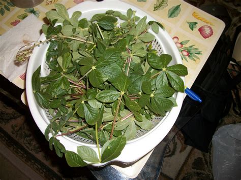

# Kochomchomi Michael omitwogik ab Kalenjin

Michael Tastes (a) Kalenjin Meal

### Dialog

| Speaker       | Kalenjin                                                | English                                                                     |
| :---- | :---- | :---- |
| Michael: | Chamgei nebo langat. | Good evening. |
| Chirchir: | Missing kot. | Good evening, too. |
| Michael: | Asiorore, tos kiame nee. | I am hungry, what’s for dinner? |
| Chirchir: | Mursik, isagek ak kimyet. | Sour milk, spider plant and ugali. |
| Michael: | Oh eh, kararan, omoche achamcham omitwogik ab Kalenjin. | Wow that’s great, I would like to taste (some) Kalenjin foods. |
| Chirchir: | Itagat, inamen kimyet ak isagek asi itaren mursik. | Welcome, start with ugali and spider plant, and then finish with sour milk. |
| Michael: | Kongoi, onyiny ago mindilil. | Thanks, (it tastes) nice and sour. |
| Chirchir: | Boiboenjin. | Enjoy. |

### Vocabulary

1. **kochomchomi** – he is tasting
2. **omitwogik** – food
3. **ab** – of
4. **chamgei** – general greeting (literally "are you healthy?")
5. **nebo** – for, of
6. **langat** – evening
7. **missing** – reply to "chamgei", literally "too much"
8. **kot** – mentioned when expressing something
9. **osiorore** (also *asiorore*) – I am hungry
10. **tos** – word used to express a question
11. **kiame nee** – what do we eat (no specific time, works in all time)
    1. **am** – to eat
    2. **nee** – what
12. **mursik** – sour milk
13. **isagek** – spider plant
14. **ak** – and
15. **kimyet** – hard mixture of corn flour and water (commonly known as *ugali* in Swahili)
16. **oh eh** – words mentioned to show surprise
17. **kararan** – nice
18. **omoche** – I want/I need
19. **chamcham** – 	to taste
    1. **achamcham** - to taste (1st person singular)
20. **itagat** – you’re welcome
21. **inam** – to begin, start
    1. **inamen** – start with
22. **asi** – and then
23. **tar** – to finish
    1. **itaren** – finish with
24. **kongoi** – thanks
25. **onyiny** – delicious
26. **ago** – but
27. **mindilil** – sour
28. **boiboenjin** – enjoy

### Vocabulary Notes

Isagek is a leafy plant that can be cooked and eaten:

Kimyet (*ugali*) is made from cornmeal and looks like this:

Mursik is a traditional fermented milk variant of the Kalenjin people of Kenya. It can be made from cow or goat milk and is fermented in a specially made calabash gourd locally known as a sotet.

### Cultural Note

In Kalenjin, *onyiny* means "sweet" or "delicious" whereas *mindilil* means "sour" or "bitter". When eating in Kalenjin and you’re asked about the food, you should explain how the food tastes, like *mursik* ("sour milk") in the dialog. It is delicious, but you have to also mention what makes it delicious. That's why we add the word *mindilil*, meaning "sour". The sourness is what makes it delicious.

### Grammar

#### 1.1 Verb Conjugations in Kalenjin

Verbs in Kalenjin hold a lot more information than in English. We'll gradually cover how they work, for now let's look at how to form simple, present tense forms.

These are the personal prefixes for verbs, telling us who the subject of the verb is:

| I | o-/a- |
| :---- | :---- |
| you (sg) | i- |
| he/she/it | - / ko- |
| we | ki- |
| you (pl) | o- |
| they | - / ko- |

Some examples:
I am hungry. – Osiorore/Asiorore.
We are hungry. – Kisiorore/Kisiorortosi.
They are hungry – Siorortos.
Are you hungry? – Tos isiorore?

#### 1.2 Present Tense (Imperfect Aspect)

The present tense is formed by adding the personal prefix at the front of the root and the tense suffix -i or -e at the end.

Take a look at the verb **chom** / **cham**, *to like* (see note at end regarding a/o):

1. achome mursik – I like sour milk
2. ichome mursik – you like sour milk
3. chome mursik – he/she likes sour milk
4. kichome mursik – we like sour milk
5. ochome mursik – you all like sour milk
6. chome mursik – they like sour milk

#### 1.3 Multiple Verbs

Note that when multiple verbs are stringed together, the personal prefix is added, but the tense suffix (-e / -i) is not.

For example, look at how the following verbs change when they come after **moch** / **mach**, *to want.* Also pay attention to the 3rd person forms, which use the prefix "ko-".
**am** (eat)

1. omoche aam kimyet – I want to eat ugali
2. imoche iam kimyet – you want to eat ugali
3. moche koam kimyet – he/she wants to eat ugali
4. kimoche keam kimyet – we want to eat ugali
5. omoche oam kimyet – you all want to eat ugali
6. moche koam kimyet – they want to eat ugali

Note: **kiame** means *we are eating*, but can also mean *it's edible*, depending on the context.

**tar** (finish)

1. omoche atar bendo – I want to finish the meat
2. imoche itar bendo – you (singular) want to finish the meat
3. moche kotar bendo – he/she wants to finish the meat
4. kimoche ketar bendo – we want to finish the meat
5. omoche otar bendo – you all want to finish the meat
6. moche kotar bendo –they want to finish the meat

**inam** (start)

1. omoche anam aam – I want to start to eat
2. imoche inam iam – you want to start to eat
3. moche konam koam – he/she want to start to eat
4. kimoche kinam keam – we want to start to eat
5. omoche onam oam – you all want to start to eat
6. moche konam koam – they want to start to eat

**chamcham** (taste)

1. omoche achamcham – I want to taste
2. imoche ichamcham – you want to taste
3. moche kochamcham – he/she wants to taste
4. kimoche kechamcham – we want to taste
5. omoche ochamcham – you all want to taste
6. moche kochamcham – they want to taste

#### 1.4 "Tos" Questions

Tos is used to mark a question. In the absence of another question word (such as *nee*, "what"), it turns the question into a yes/no question:

1. Tos imoche chego? – Do you want milk?
2. Tos korur kimyet i? – Is the ugali ready?
3. Tos iame isagek i? – Do you eat spider plant?

#### 1.5 Inamen / inam

Words ending with -en are a sort of guidance as to what you should do, almost like a command, as you’re instructed how to do something.

1. inam – to start/begin
   inamen – start with/begin with
   1. *inamen chego* "start with milk"
2. kwany – to cook (mostly used in ugali).
   kwanyen/kwangen – cook with/using
   1. *kwanyen/kwangen* *chepungut* "cook using a clay pot"
3. tar – to finish
   taren – finish with/finish using
   1. *taren ingwek* "finish by eating ('*using'*) the vegetables"
4. taach – to welcome
   taachen/taagen- welcome with/welcome using
   1. *taachen/taagen kimyet* "welcome with the ugali", "help yourself to the ugali"

#### 1.6 a vs. o

In Kalenjin, "a" and "o" are often interchangeable. The pronunciation is the same for most words which start with "a" or "o".
Kipsigis is the Kalenjin dialect spoken by most Kalenjin tribes, and in this dialect (which the course is based off of) you often hear them used interchangeably.

*achame* or *ochome*	I like it or I love it
*akwanye* or *okwonye*	I am cooking
*arire* or *orire*	I am crying
*achamchami* or *ochomchomi*	I am tasting
*asiorore* or *osiorore*	I am hungry

Whether you use "a" or "o" in these words, the meaning remains the same. The form with “a” is used by all Kalenjin tribes, but the “o” is only used in the Kipsigis dialect. Notice that other "a" sounds generally switch to an "o" as well, not just the initial letter.

